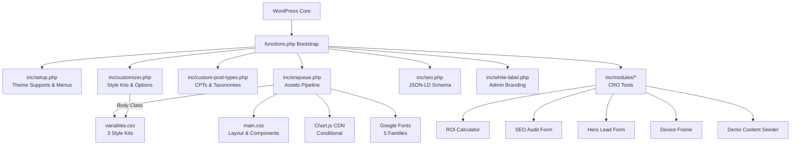

# Architecture Document

## Architecture Pattern

**WordPress Hybrid Theme** — Combines classic PHP template hierarchy with modern block editor (`theme.json` v2) support. Uses a modular include pattern (`functions.php` → `inc/*.php`) rather than OOP classes.

## System Architecture

## Design System: Style Kits

The theme implements a CSS Custom Properties-based design system with 3 interchangeable presets:

| Kit | Aesthetic | Colors | Typography |
|---|---|---|---|
| **Tech-Futurist** | Dark, neon, futuristic | `#0B0F19` bg, `#3B82F6` primary, `#10B981` accent | Orbitron + Rajdhani |
| **Corporate-Stabilizer** | Clean, white, trustworthy | `#FFFFFF` bg, `#0F172A` primary, `#2563EB` accent | Inter + Inter |
| **Creative-Disruptor** | Bold, brutalist, kinetic | `#FFFAF0` bg, `#000000` primary, `#FF0080` secondary | Space Grotesk + DM Sans |

**Mechanism:** Customizer → `hoplytics_style_kit` setting → `body.style-kit-{name}` class → CSS variables cascade.

## Data Architecture

### Custom Post Types

| CPT | Key Fields | Meta Fields | Relationships |
|---|---|---|---|
| `project` | title, editor, thumbnail, excerpt, custom-fields | `_related_service_id` | → Service (via meta box) |
| `service` | title, editor, thumbnail, page-attributes | — | Hierarchical (parent/child) |
| `team_member` | title, thumbnail, excerpt (bio) | — | — |
| `testimonial` | title (client name), editor (quote), thumbnail | `_related_service_id` | → Service (via meta box) |
| `career` | title, editor | `location`, `job_type` | — |

### Taxonomies

| Taxonomy | Attached To | Type |
|---|---|---|
| `industry` | project | Hierarchical (categories) |
| `tech_stack` | project | Flat (tags) |
| `service_type` | service | Hierarchical |
| `department` | team_member, career | Hierarchical |

## Schema / SEO Architecture

JSON-LD structured data is output in `<head>` via `wp_head` hook:

| Page Context | Schema Type | Key Properties |
|---|---|---|
| Front Page | Organization + LocalBusiness | name, logo, contactPoint, address, openingHours |
| Contact Page | LocalBusiness | Same as front page |
| Single Service | Service | name, provider, description, areaServed |
| Single Project | Article | headline, image, author, publisher, datePublished |
| Single Career | JobPosting | title, employmentType, jobLocation, validThrough |
| Project/Service Archive | ItemList | position-ordered list of URLs |

## Asset Pipeline

### CSS Loading Order
1. Google Fonts (5 families, CDN)
2. `variables.css` — Design tokens & Style Kit definitions
3. `main.css` — Layout, typography, components (depends on variables)
4. `style.css` — Theme header + additional component styles
5. `nav.css` — Navigation (loaded separately)
6. `hero-form.css` — Hero form styles (conditional)

### JavaScript
1. `main.js` — Mobile menu toggle, smooth scroll, UI interactions
2. `roi-calculator.js` — ROI calculation logic, Chart.js rendering
3. `chart.js` (CDN, conditional) — Only loaded on pages with ROI calculator or specific templates

## Form Handling

Both forms use WordPress `admin-post.php` pattern:

| Form | Action Hook | Security | Handler |
|---|---|---|---|
| Hero Lead Form | `hoplytics_hero_lead` | wp_nonce | `inc/modules/hero-form-handler.php` |
| SEO Audit Form | `hoplytics_seo_audit` | wp_nonce | `inc/modules/seo-audit.php` |

Both send HTML emails to `admin_email` and redirect with success query parameter.

## Navigation Menus

| Location | Slug | Usage |
|---|---|---|
| Primary | `menu-1` | Main header navigation |
| Footer Company | `footer` | Company links column |
| Footer Services | `footer-services` | Services links column |

## Image Sizes

| Name | Dimensions | Crop | Usage |
|---|---|---|---|
| `card-large` | 800×600 | ✅ | Portfolio cards, large grid items |
| `card-small` | 400×300 | ✅ | Grid items, thumbnails |
| `avatar` | 200×200 | ✅ | Team members, testimonials |

## Customizer Sections

| Section | Settings Count | Key Settings |
|---|---|---|
| Style Kits | 1 | `hoplytics_style_kit` (3 choices) |
| Header Options | 2 | CTA text, CTA URL |
| Front Page Hero | 7 | Headline, subheadline, 2 buttons, visual image |
| Trusted By | 6 | Title + 5 logo image slots |
| Footer Options | 3 | Tagline, email, phone |
